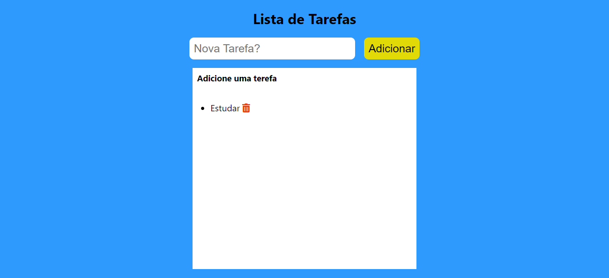

# TodoList React

Um site de lista de tarefas

## Sobre o Projeto

Este projeto consiste em adicionar e remover tarefas da lista

## Demonstração do projeto

Foto do projeto

Resultado final: https://wizardly-ramanujan-47d3ac.netlify.app/

## Objetivo do projeto

Projeto desenvolvido para treinar React.js

## Tecnologias Usadas no projeto

Projeto feito utilizando as seguintes linguagens/tecnologias: 

* React.js

## Instalação

Para que este projeto rode em sua máquina, siga os passos abaixo:

Clone este repositório em uma pasta em sua máquina  
$ git clone https://github.com/Leveditor/TodoListReact.git
